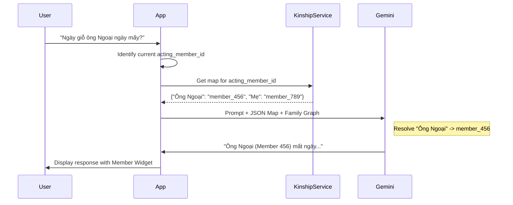

# AI Assistant (@family) - Technical Solution

## Kinship Resolution Flow

## Integration
- **Engine**: Google Generative AI (Gemini).
- **Tooling**: GenUI for Flutter (rendering interactive widgets based on AI responses).

- **Context Injection**: 
  - **Acting Member Context**: Every AI request includes the `acting_member_id`.
  - **Role-Aware History**: Conversation history is injected as a sequence of messages with explicit roles (`user`, `model`, `system`).
  - **Tree Snapshot**: Instead of raw relational lookups, the AI uses the latest `family_tree_snapshots` for hierarchical and positional context.
  - **Relative Pronunciation**: Pre-calculated mapping of Vietnamese kinship titles to member IDs relative to the `acting_member_id`.
    - Example: `acting_as: member_1_7 (Mẹ), mappings: {"Ông Ngoại": "member_0_1", "Mẹ": "member_1_7", "Ba": "member_1_8" ...}`
- **Kinship Strategy**: 
  - The AI uses the tree hierarchy (LCA algorithm context) to suggest hierarchical titles for members without pre-defined relationships.
- **Default Payload**: Full relational snapshot of user's connected families and contacts.

## Personality & Instruction Logic
- **Storage**:
  - **Global Instructions**: Stored in a `system_configs` table in Postgres (Level 1).
  - **Family Instructions**: Stored in the `families.ai_behavior_instructions` column (Level 2).
- **System Prompt Construction**:
  1. Fetch Global Instructions.
  2. If `family_id` is present, fetch Family Instructions.
  3. **Concatenation**: `[Global Base] + "\n\nSpecific Family Context:\n" + [Family Instructions]`.
  4. Inject current `acting_member_id` and relationship map.
- **Validation**: Admins see a "Behavior-only" disclaimer reminding them these fields do not modify family data records.

## Performance & History
- **Structured Messaging**: All AI responses are stored as JSON structures.
  - **Type: `text`**: Standard markdown response.
  - **Type: `genui`**: Contains `intent` and `payload` (e.g., `intent: "show_timeline", data: [...]`).
- **Database**: Firebase Realtime DB (for token streaming) + Postgres (for long-term history).
- **Rendering**: 
  - `TextContentBuilder`: Processes markdown.
  - `GenUIWidgetFactory`: Intercepts `genui` types to render interactive tree/photo/event widgets.

## Group Chat Logic
- Mention detection: Cloud Function listens to group messages -> if contains `@family` -> Invoke Gemini API -> Post reply as a bot member.
