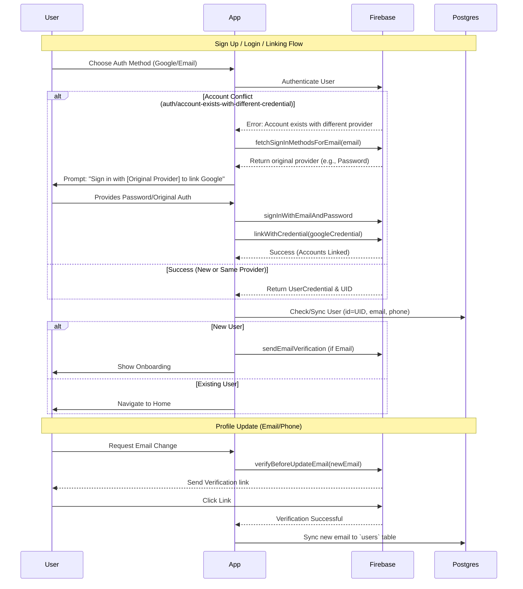

# Authentication - Technical Solution

## User Journey Flow

## Database Schema (PostgreSQL)

## Core Service
- **Provider**: Firebase Authentication.
- **Plugins**: `firebase_auth`, `google_sign_in`.
- **Registration**: Use `createUserWithEmailAndPassword` and `sendEmailVerification`.

## Account Linking & Conflict Resolution
- **Strategy**: Unified Email Identity.
- **Provider Conflicts**:
  1. **Google first, then Email**: Firebase prevents direct creation of a password for a Google-only email without verification.
  2. **Email first, then Google**: 
     - Catch `auth/account-exists-with-different-credential`.
     - Fetch existing sign-in methods using `fetchSignInMethodsForEmail`.
     - Prompt user to sign in with original provider, then use `linkWithCredential` to merge the Google identity.
- **Automatic Merging**: In Firebase Console, "One account per email address" should be enabled. Google is treated as a "trusted" provider to allow automatic linking in many flows, but manual linking via SDK is the safest implementation for cross-platform consistency.

## Deletion Grace Period Implementation
To support the 30-day deletion requirement:
- **PostgreSQL Metadata**: When a user clicks "Delete", we update their record in the `users` table with a `deletion_requested_at` timestamp.
- **Backend Service (Go/Cloud Functions)**:
    - **Scheduled Task**: Runs daily to delete any user record and Firebase Auth account where `deletion_requested_at` > 30 days.
    - **Cleanup Task**: On user deletion, securely remove their 5GB storage assets and clean up relationships in the `family_members` table.
- **App Logic**:
    - If a user logs in and `deletion_requested_at` is non-null, show a "Reactivate Account" screen.

## Phone Auth (Firebase PNV)
- **Implementation**: Use `FirebaseAuth.instance.verifyPhoneNumber`.
- **Flow**:
  1. `codeSent`: Capture `verificationId`.
  2. `codeAutoRetrievalTimeout`: Handle SMS timeout.
  3. `verificationCompleted`: Handle automatic OTP code retrieval (Android).
  4. `verificationFailed`: Handle invalid format or blocked numbers.
- **Postgres Integration**:
  - Upon successful verification and Firebase account creation, the user's `phone_number` is synchronized/verified in the Postgres `users` table.
  - Supports linking phone number to an existing Email/Google account via `linkWithCredential`.

## Profile Re-validation Technicals
- **Email Update**:
  1. User enters new email.
  2. Call `User.verifyBeforeUpdateEmail(newEmail)`.
  3. Postgres `users` table is updated *only* after Firebase confirms successful verification.
- **Phone Update**:
  1. User triggers update.
  2. Initiate `verifyPhoneNumber` on the new number.
  3. Upon success, call `User.updatePhoneNumber(credential)`.
  4. Sync the new phone number to Postgres.
- **Avatar Storage**:
  - Upload to Firebase Storage path: `/users/{uid}/avatars/{timestamp}.jpg`.
  - Update `photo_url` in both Firebase Auth and Postgres `users` table.
