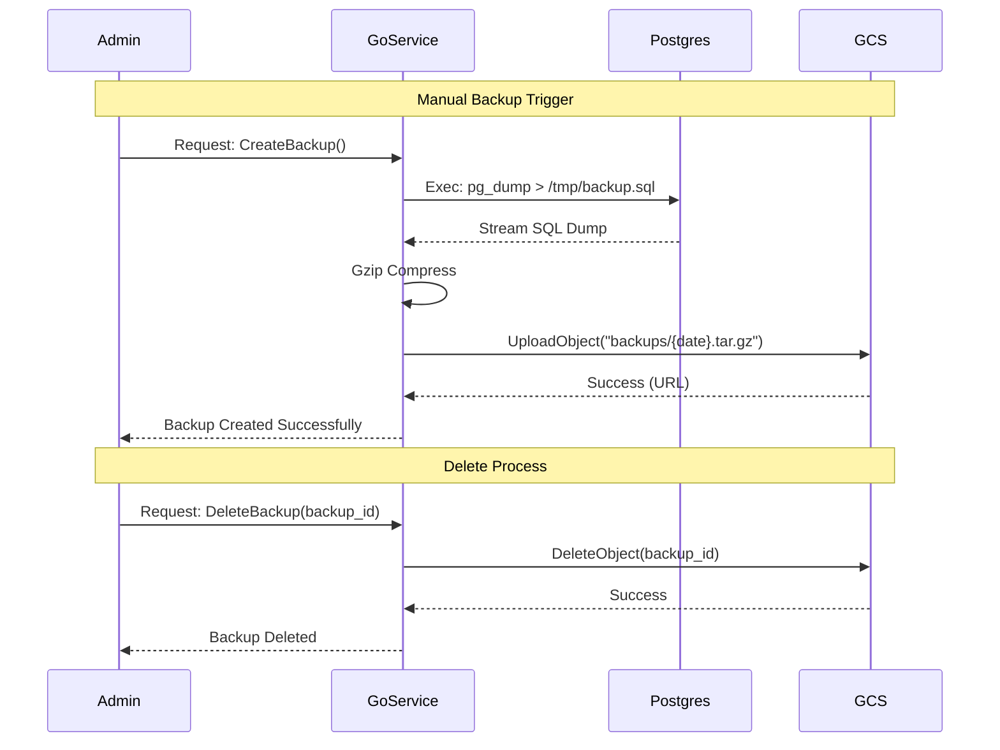

## Backup & Restore Technical Flow

### Security & Permissions
- **Service Account**: Go Backend uses a GCP Service Account with `Storage Object Admin` role.
- **Encryption**: GCS Server-Side Encryption (default) + Transfer via HTTPS.
### APIs & Prerequisites
- **GCP Project**: `familytree-db-all` (Hosts VM + Backups).
- **Required APIs**:
  - `compute.googleapis.com` (For VM Management).
  - `storage.googleapis.com` (Cloud Storage API for Backups).
- **Buckets**:
  - `gs://familytree-backups-prod`
  - `gs://familytree-backups-dev`
