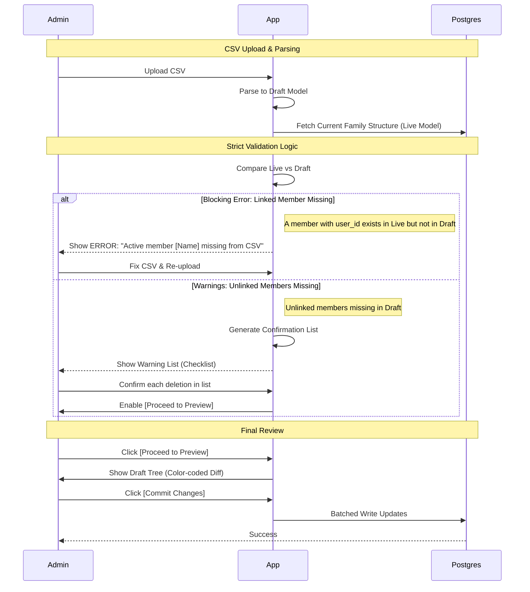
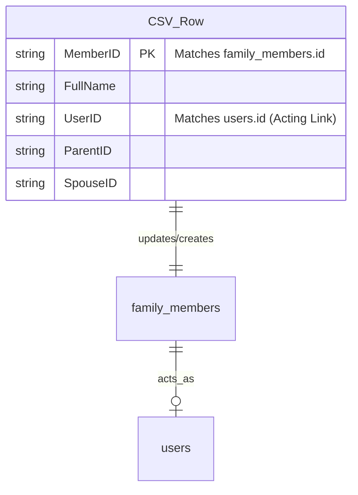

# Data Management - Technical Solution

## Bulk Import Validation Flow

## Mapping Schema (CSV to DB)

## Serialization
- **Format**: Comma Separated Values (CSV).
- **Encoding**: UTF-8 (Required for Vietnamese character support).

## Processing & Preview Flow
1. **Parsing & Validation**:
   - Parse CSV into a `DraftFamilyModel`.
   - **Link Check**: Identify nodes in `LiveFamilyModel` where `user_id IS NOT NULL`.
   - **Strict Validation**:
     - `INVALID`: If a node from `LiveFamilyModel` with a `user_id` is missing in `DraftFamilyModel` -> Stop process, show error.
     - `WARNING`: If a node from `LiveFamilyModel` with `user_id IS NULL` is missing in `DraftFamilyModel` -> Add to confirmation list.
2. **Confirmation Interface**:
   - Display a list of all `WARNING` items.
   - Admin must toggle each item to `confirmed`.
   - The "Proceed to Preview" button is enabled only when `all(warnings.confirmed)`.
3. **Diffing Algorithm**:
   - Categorize nodes: `Identical`, `Modified`, `New`, `DeletionWarning`.
4. **Visualization (Preview Mode)**:
   - Use the Family Tree renderer in "Preview State".
   - Color coding:
     - **Green Overlay**: New nodes/branches.
     - **Yellow Overlay**: Updated fields in existing nodes.
     - **Cyan/Blue Outline**: Member node linked to a different User.
     - **Red/Error**: Invalid mapping attempts.
     - **Strikethrough/Grey**: Confirmed deletions.
5. **Execution**:
   - On final approval, trigger batched writes to Postgres.

## Parent-Child Linking
- Import will attempt to link children to parents using the `ParentID` or `ParentName` columns provided in the CSV.
- If a parent isn't in the system, create a placeholder node.
