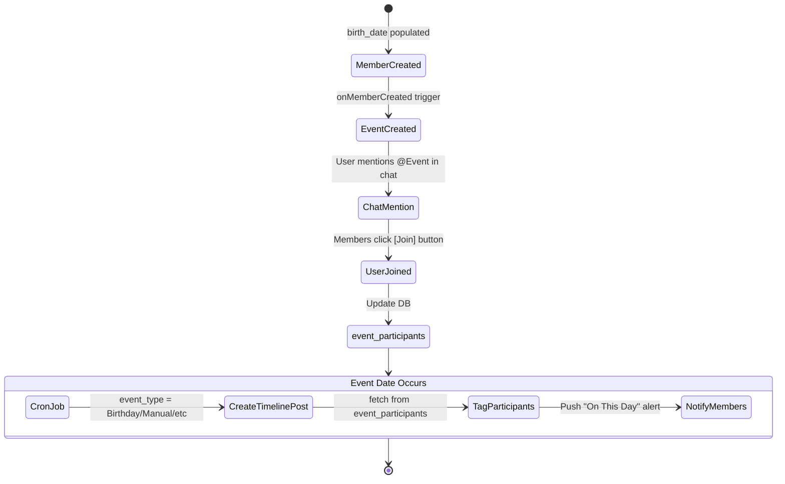
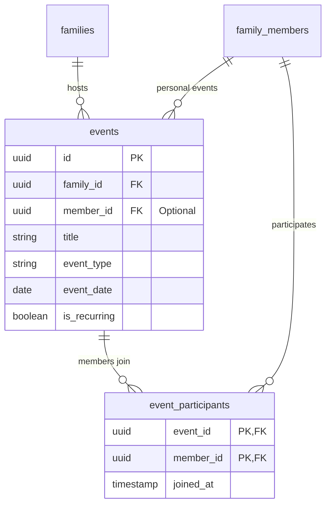

# Events - Technical Solution

## Event-Timeline Lifecycle

## Database Schema (PostgreSQL)

## Data Modeling (PostgreSQL)
- **`events` table**:
  - `id`: Primary Key.
  - `family_id`: Foreign Key.
  - `member_id`: Foreign Key (Optional, for personal events like birthdays).
  - `title`: String.
  - `event_type`: Enum (Birthday, Death, Custom).
  - `event_date`: Date.
  - `is_recurring`: Boolean (True for Birthdays/Deaths/Yearly events).
- **`event_participants` table**:
  - `event_id`: Foreign Key.
  - `member_id`: Foreign Key.
  - `joined_at`: Timestamp.

- **Uniqueness Check**:
  - PostgreSQL level: Upsert logic or composite unique index on `(family_id, member_id, title, event_date)`.
  - App level: Check for existing events of the same type/date/member before allowing manual creation.
- **Timeline Connection**:
  - Added `event_id` (Foreign Key) to `timeline_posts` table.

## Automated Logic
- **Trigger**: `onMemberCreated` / `onMemberUpdated`.
- **Logic**: 
  - If `birth_date` is present, upsert a recurring Birthday event (matching the new date).
  - If `death_date_solar` is present, upsert a recurring Death Anniversary event (matching the new date).
  - If a date is removed from the profile, the corresponding automatic event is also removed.

## Event-Timeline Automation
- **Trigger**: Daily Cron Job (at event time).
- **Logic**: Create a record in `timeline_posts` for each active event today.
- **Tagging**: Link records in `timeline_tags` for all members found in `event_participants` for that `event_id`.

## Event Retrieval with History
- **Query**:
  - To show an event with its timeline:
    `SELECT * FROM timeline_posts WHERE event_id = ? OR (owner_member_id = ? AND EXTRACT(MONTH FROM event_date) = ? AND EXTRACT(DAY FROM event_date) = ?)`
  - This retrieves posts explicitly tagged to the event OR posts from the same member/family on that calendar day in history.
