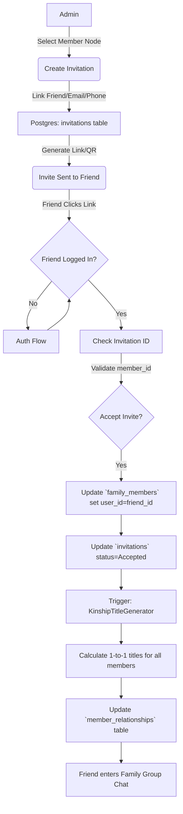
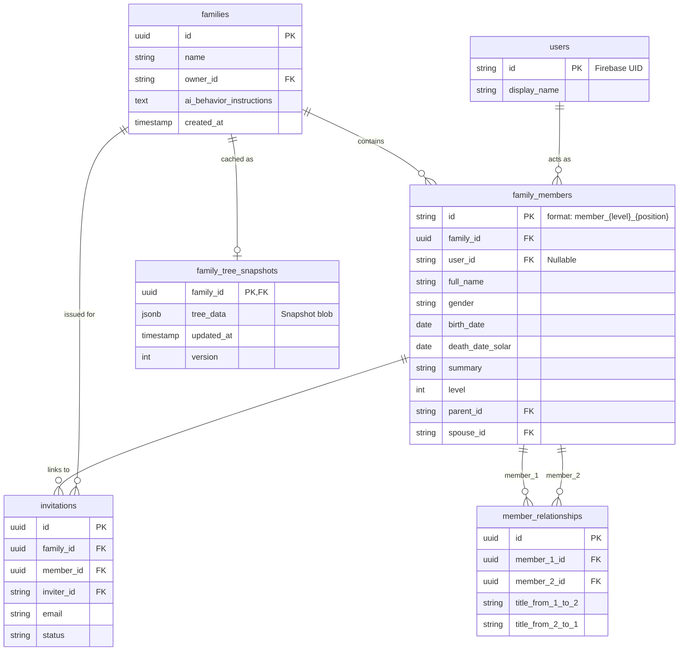

# Family Core - Technical Solution

## Invitation & Participation Flow

## Database Schema (PostgreSQL)

## Data Modeling (PostgreSQL)
- **`families` table**: id, name, owner_id, ai_behavior_instructions, created_at.
- **`users` table**: id (UID from Firebase), email, phone, display_name.
- **`family_members` table**: 
  - `id`: Primary Key (String). **Format**: `member_{level}_{position}`.
  - `family_id`: Foreign Key.
  - `user_id`: Nullable (if member hasn't joined app).
  - `full_name`: String.
  - `gender`: Enum (Male/Female).
  - `birth_date`: Date.
  - `birth_year`: Integer.
  - `death_date_solar`: Date.
  - `death_date_lunar`: String.
  - `phone`: String.
  - `address`: Text.
  - `general_info`: Text (Markdown format).
  - `summary`: Text.
  - `level`: Integer (Distance from root).
  - `parent_id`: Reference to another `family_members.id`.
  - `spouse_id`: Reference to another `family_members.id`.

- **`invitations` table**:
  - `id`: Primary Key.
  - `family_id`: Foreign Key.
  - `member_id`: Foreign Key (Link to a specific `family_members` node).
  - `inviter_id`: ID of the admin.
  - `email`: String (Optional).
  - `phone`: String (Optional).
  - `code`: String (For QR/Short-link).
  - `status`: Enum (Pending/Accepted/Expired).

- **`member_relationships` table**:
  - `id`: Primary Key.
  - `family_id`: Foreign Key.
  - `member_1_id`: Foreign Key (Matches hierarchical `id`).
  - `member_2_id`: Foreign Key (Matches hierarchical `id`).
  - `title_from_1_to_2`: String.
  - `title_from_2_to_1`: String.
  - (Unique Constraint on `member_1_id`, `member_2_id`).

- **Relationship Persistence**: 
  - `member_relationships` records are linked to `member_id`s, not `user_id`s. 
  - Changes to the `users` table or account deletions do not affect these relational titles.

## Pronunciation & Title Logic
- **Base Logic**: Relationships and titles are calculated between any two **FamilyMember** nodes in the tree.
- **Automated Pre-calculation**: 
  - **Trigger**: `onMemberCreated` / `onMemberRelinked` (when parent/spouse IDs change).
  - **Sync Logic**: When a member is added or their hierarchy changes, the system iterates through all other members in the `family_id` and calculates/updates the `member_relationships` entries.
- **Inheritance via "Acting"**:
  - When a `User` chooses to "Act" as a specific `FamilyMember`, the app calculates all titles for that user *as if* they were that member node.
  - **Family Isolation**: If the same two users belong to multiple common families, their pronunciations/titles are calculated independently for each family based on their "Acting" node in that family.
  - For example, if User X acts as "Member_2_27" (Bình), User X will see "Ông Ngoại" for "Member_0_1" because the relationship is established node-to-node.
- **Tree Reindexing & Cascading Updates**:
  - **Requirement**: If a relationship change affects the tree topology (e.g., moving a parent), the `level` and hierarchical `id` (`member_{level}_{position}`) of the affected node and all its descendants must be recalculated.
  - **Performance**: High-performance rendering in Flutter relies on these pre-calculated hierarchical IDs for instant positioning.
  - **Cascade**: All foreign key references in `member_relationships`, `invitations`, `timeline_tags`, and `messages` (if tagged) must be updated to the new hierarchical ID using a transaction.
- **Algorithm**:
  1. Determine the **Lowest Common Ancestor (LCA)** between Member A and Member B.
  2. Calculate the distance (Level delta) to the LCA.
  3. Map the (Direction + Distance) to a Vietnamese kinship term.
  4. Manual Override: The `summary` field (e.g., "Ông Ngoại") can act as a display title override.

## Real-time Integration
- While primary data is in Postgres, family presence or active invites can be mirrored to Firebase Realtime Database for instant UI updates.

## QR Code System
- Use **Firebase Dynamic Links** (or custom deep links) embedded in a QR code.
- Link format: `https://familytree.page.link/invite?code={inviteId}`.
- QR Generation: `qr_flutter` package.

## Tree Snapshotting & Caching
- **Server-Side Snapshot**:
  - **Table**: `family_tree_snapshots`.
  - **Trigger**: `onTreeTopologyChanged` (after hierarchical reindexing completes).
  - **Logic**: The Go backend serializes the entire family tree structure into a JSONB blob (including names, IDs, levels, and pre-calculated titles).
  - **Invalidation**: Any change to `family_members` or `member_relationships` bumps the `version` and triggers a background snapshot refresh.
- **Client-Side Caching (Flutter)**:
  - **Mechanism**: Use **Hive** or **SQLite** for local persistence.
  - **Sync Logic**:
    1. App requests tree via gRPC with its local `version`.
    2. If `server.version == client.version`, Go returns `NOT_MODIFIED` (empty body).
    3. If different, Go returns the full `tree_data` blob.
  - **Performance**: Reduces the `GetFamilyTree` gRPC call to a simple version check in most sessions, allowing for immediate offline rendering.
