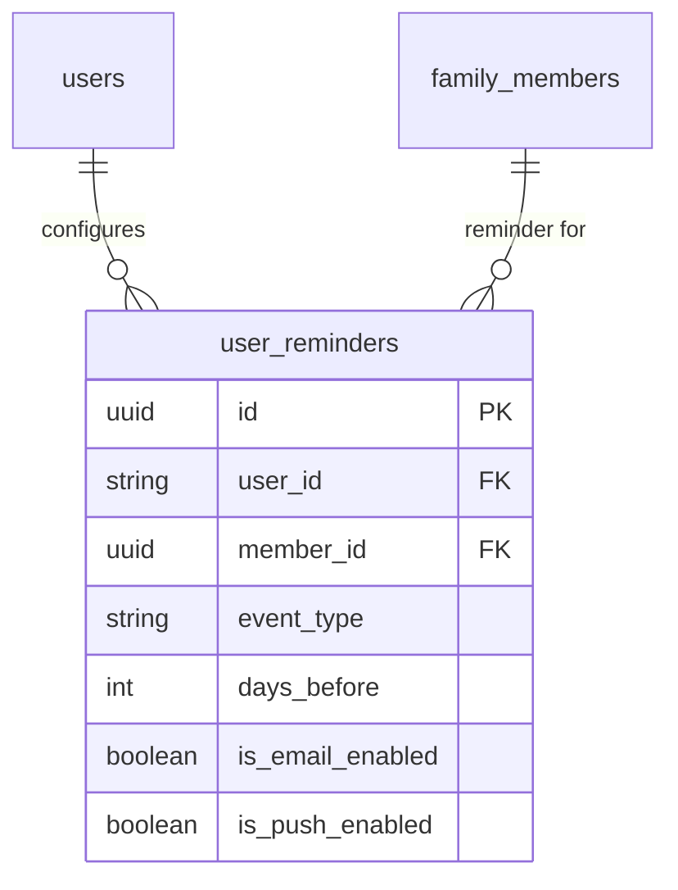

# Notifications - Technical Solution

## Infrastructure
- **Push Provider**: Firebase Cloud Messaging (FCM).
- **Email Provider**: SendGrid or Firebase Extensions (Trigger Email).
- **Backend**: Go-based scheduler or Firebase Scheduled Cloud Functions.

## Database Schema (PostgreSQL)

## Reminder Logic & Scheduling
- **Data Storage (Postgres)**:
  - `user_reminders` table: `id`, `user_id`, `member_id`, `event_type` (birthday/death), `days_before`, `is_email_enabled`, `is_push_enabled`.
  - `user_conversation_settings` table: `user_id`, `conversation_id`, `is_muted` (boolean), `muted_until` (timestamp, null for indefinite).
- **Notification Filtering**:
  - **Push**: Cloud Functions check if `is_muted` is true AND (`muted_until` is null OR `muted_until > now()`) before dispatching payloads.
- **Scheduler**:
  - A cron job runs daily at **0:00 UTC (equivalent to 7:00 AM GMT+7)**.
  - Query 1: Find all `user_reminders` for Birthdays/Deaths.
  - Query 2: Find all `timeline_posts` where `event_date` month/day matches today (excluding current year).
  - Dispatch: Iterate and send via required providers.

## Device Token Management
- App registers FCM token on startup/login.
- Tokens stored in Postgres `user_device_tokens` table.
- Automatic cleanup of stale/invalid tokens.
