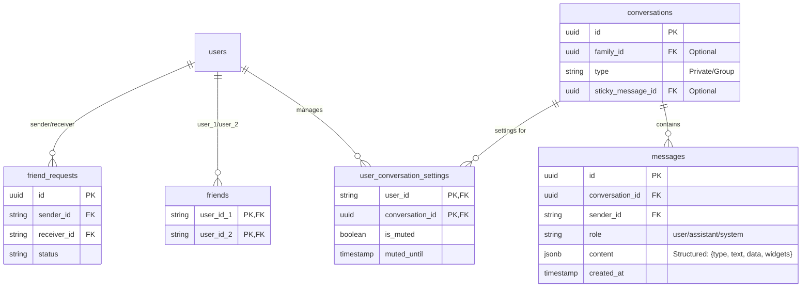

# Social & Chat - Technical Solution

## Database Schema (PostgreSQL)

## Friend System (PostgreSQL)
- **`friend_requests` table**:
  - `id`: Primary Key.
  - `sender_id`: Foreign Key.
  - `receiver_id`: Foreign Key.
  - `status`: Enum (Pending, Accepted, Declined).
  - `created_at`: Timestamp.
- **`friends` table**:
  - `user_id_1`: Foreign Key.
  - `user_id_2`: Foreign Key.
  - (Composite Primary Key).
- **Search Logic**: 
  - Index `email` and `display_name` in Postgres for prefix search.
  - Limit search results to 20 for performance.

## Messaging Infrastructure
- **Real-time Engine**: Firebase Realtime Database (RTDB) for active message syncing.
- **Persistent Storage**: PostgreSQL for long-term message history and relational metadata.
- **History Rendering**:
  - App loads initial state from RTDB.
  - Historical messages (> 50-100) are fetched from the Postgres API via pagination.

## Asset Storage (Images)
- **Bucket**: Firebase Storage.
- **Quota Management**:
  - `storageUsed` field in User Firestore document.
  - **Cloud Function (onUpload)**: Check file size -> update `storageUsed` -> block if > 5GB.

## Video Calling (WebRTC)
- **Signaling Server**: Go-based server (hosted on Cloud Run or similar).
- **STUN/TURN**: Using standard protocols to traverse NAT.
- **Flutter Integration**: `flutter_webrtc` package.
- **Go Logic**: Manages room state and peer-to-peer handshakes.

## Group Management
- **Default Group Logic**: 
  - Cloud Function: `onFamilyCreated` -> Creates a Record in `conversations` table linked to `family_id`.
  - Cloud Function: `onMemberAdded` -> Automatically adds user to the family's default group chat.
- **Member Preferences**: Store `is_muted` status in `user_conversation_settings` table to control push notification triggers.
- Dynamic membership lists in Firebase.
- **Push alerts**: Triggered via Cloud Functions / Realtime DB listeners for new messages in both private and group chats.
- Push notifications for new messages via Firebase Cloud Messaging (FCM).

## GenUI Widget Registry (Chat)
Standard `StructuredContent` types for chat widgets:
| Type | Data Payload Example | Flutter Widget |
| :--- | :--- | :--- |
| `image` | `{url, thumbnail, width, height}` | `ChatImageGallery` |
| `location` | `{lat, lng, address}` | `ChatMapView` |
| `mention` | `{type: 'member', id: 'uid'}` | `MemberChip` |
| `url_embed` | `{url, title, desc, image}` | `RichLinkPreview` |
| `video_embed` | `{url, provider: 'youtube', videoId}` | `YoutubeLitePlayer` |

- **Metadata Sync**: 
  - For URL/Video embeds, the client or a Cloud Function fetches OGP (Open Graph) metadata and updates the message `content.data` field to avoid redundant client-side fetching.

## Sticky Widget Infrastructure
- **State Management**: 
  - The `sticky_message_id` is stored in PostgreSQL as the source of truth.
  - Active sticky state is mirrored in **Firebase RTDB** at `/conversations/{id}/sticky` for instant reactive updates across all clients.
- **Member Permissions**: Any authenticated member of the conversation URI can invoke the `PinMessage` gRPC call to update the sticky node.
- **GenUI Integration**: The sticky widget renders using the same `GenUIWidgetFactory` as standard structured messages, maintaining state (like "Join" counts) via real-time streams.
