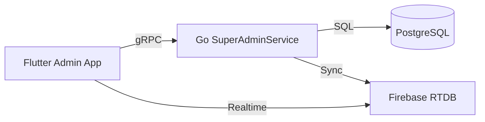

# Super Admin - Architecture

## DDD Layers (Admin App context)

### 1. Domain Layer
- **Entities**: `AdminUser`, `SystemStats`, `FamilyAccessGrant`.
- **Interfaces**: `ISystemRepository`, `IAdminManagementService`.

### 2. Data Layer
- **Implementation**: `GoSuperAdminRepository`.
- **Service**: `SuperAdminService` (gRPC).
- **Interceptors**: `AuthInterceptor` (JWT validation).

### 3. App Layer
- **Providers**: 
  - `systemStatsProvider`: Stream of real-time dashboard data.
  - `userManagementProvider`: Handles search and status updates for the user directory.
- **Flows**: `FamilySupportJoinFlow` (Accepting family invites).

### 4. View Layer
- **Components**:
  - `AdminDashboard`: Grid of key performance indicators.
  - `UserActionMenu`: Contextual controls for managing user accounts.
  - `FamilyManagementConsole`: Specialized UI for providing support to individual families.
  - **Shared UI Modules**: Reuses components from `user_app` for tree rendering, timeline management, and event creation to ensure feature parity.

## Core Logic Reuse
- The `admin_app` and `user_app` both utilize the same `shared_package` for:
  - **Domain Entities**: (Member, Event, Timeline).
  - **Data**: gRPC client implementations for `FamilyService`, `TimelineService`, etc.
  - **App Logic**: State management for tree manipulation and data validation.

## Integration Diagram

