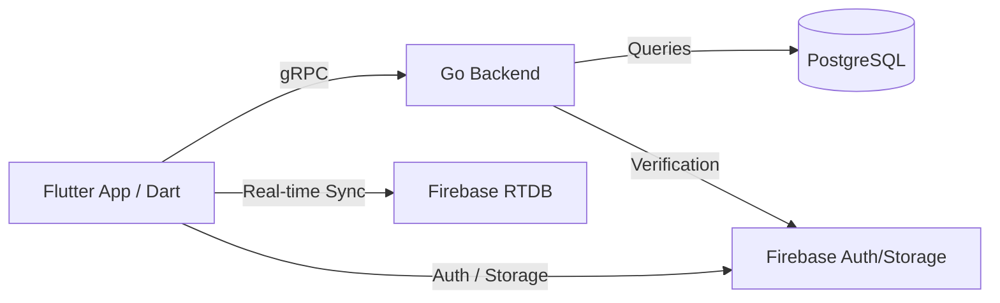

# System Architecture & Integration

## Overview
This document defines the interface standards between the **Flutter (Dart)** frontend and the **Go** backend services.

## High-Level Data Flow


## Communication Protocols
1.  **Command/Query API (Go)**:
    - **Protocol**: gRPC (Google Remote Procedure Call) with Protocol Buffers.
    - **Interceptors**: 
      - Client-side: `FirebaseAuthInterceptor` (attaches Bearer token).
      - Server-side: `AuthInterceptor` (verifies token with Firebase Admin SDK).
2.  **Real-time Messaging**:
    - Handled via **Firebase RTDB** for low-latency delivery.
    - Go server acts as a listener for certain triggers (mentions, events) using the Firebase Go SDK.
3.  **Signaling (WebRTC)**:
    - **Protocol**: WebSockets (Gorilla WebSocket in Go).
    - Dedicated Go signaling service for multi-platform video call negotiation.

## Shared Data Contracts (Protobuf)
To ensure binary-compatible synchronization:
- **Source of Truth**: `.proto` files in the `shared_protos/` directory.
- **Dart**: Generate classes using `protoc` with `dart_out`.
- **Go**: Generate server stubs and mocks using `protoc-gen-go` and `protoc-gen-go-grpc`.

### Example DTO Mapping:
| Entity | Go Struct | Dart Entity (Freezed) |
| :--- | :--- | :--- |
| **FamilyMember** | `Member` | `FamilyMember` |
| **Invitation** | `Invite` | `Invitation` |
| **ChatMessage** | `Message` | `ChatMessage` (with `role` & `StructuredContent`) |

## Error Handling Standards
The Go backend returns standard HTTP status codes with a JSON error payload:
```json
{
  "error": {
    "code": "permission_denied",
    "message": "You do not have permission to edit this member.",
    "details": { "required_role": "Admin" }
  }
}
```

## Service Boundaries
| Responsibility | Owned By |
| :--- | :--- |
| **Auth Verification** | Go (via Firebase JWT) |
| **Tree Logic / LCA** | Go (Pre-calculated / Heavy traversal) |
| **Relational Metadata** | Go (PostgreSQL) |
| **Media Hosting** | Firebase Storage (Client Upload) |
| **Notification Triggers** | Go (Cloud Tasks / Cron) |
