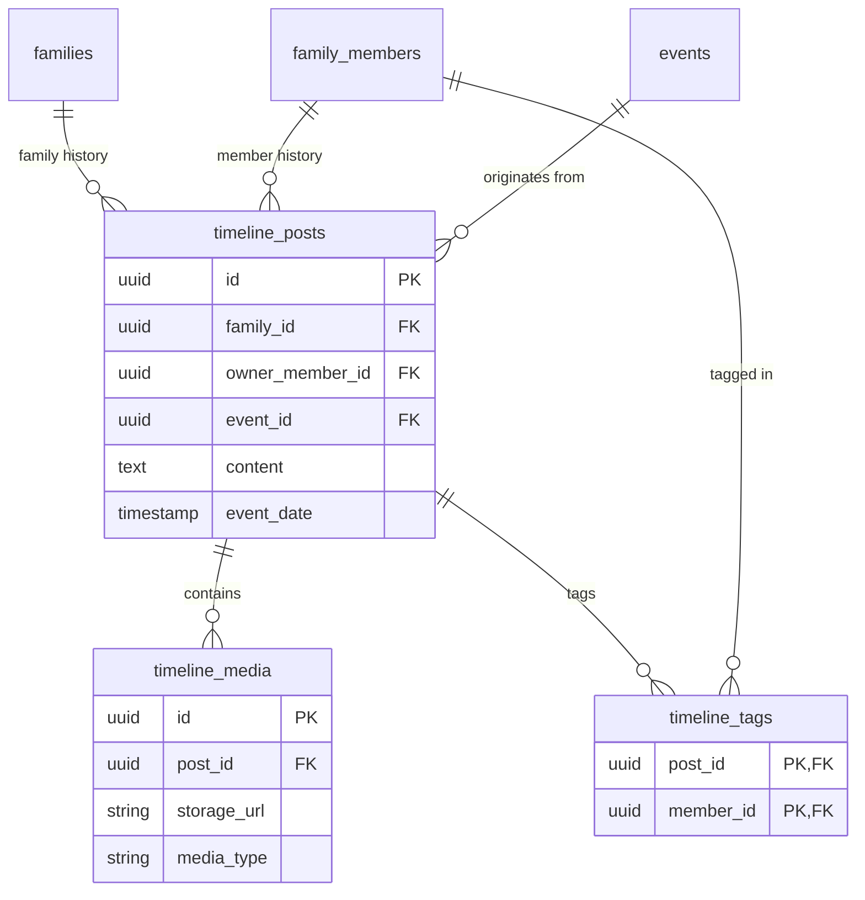

# Timeline - Technical Solution

## Database Schema (PostgreSQL)

## Data Modeling (PostgreSQL)
- **`timeline_posts` table**:
  - `id`: Primary Key.
  - `family_id`: Foreign Key.
  - `owner_member_id`: Foreign Key (Optional, if it's a member-specific post).
  - `content`: Text (Markdown).
  - `event_date`: Timestamp.
  - `created_at`: Timestamp.
- **`timeline_media` table**:
  - `id`: Primary Key.
  - `post_id`: Foreign Key.
  - `storage_url`: String.
  - `media_type`: Enum (Image / Video).
- **`timeline_tags` table**:
  - `post_id`: Foreign Key.
  - `member_id`: Foreign Key.

## "On This Day" Logic
- **Query**:
  - `SELECT * FROM timeline_posts WHERE family_id = ? AND EXTRACT(MONTH FROM event_date) = ? AND EXTRACT(DAY FROM event_date) = ? AND EXTRACT(YEAR FROM event_date) < ?`
- **Indexing**: Composite index on `(family_id, EXTRACT(MONTH FROM event_date), EXTRACT(DAY FROM event_date))` for efficient memory retrieval.

## Storage Integration
- Images uploaded to Firebase Storage: `/families/{family_id}/timeline/{post_id}/{filename}`.
- Respect 5GB user quota.
